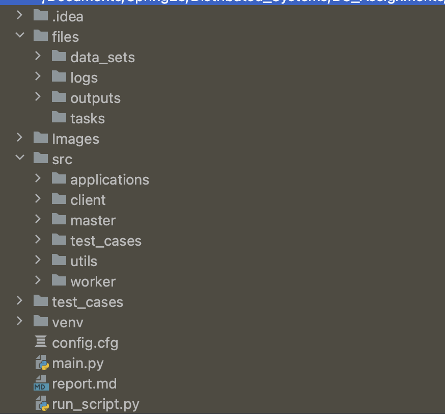
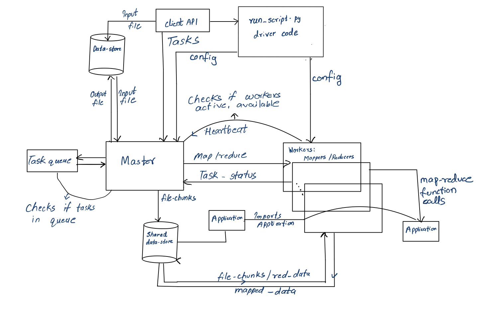

# Map-Reduce

### Contents
- About Project
  - Folder Structure
  - How to set up and run
  - Class Diagram/Architecture
- Design Principles
- Design Detail
  - Master-Worker Communication
  - Task Queue
  - Task Handler
  - Fault Tolerance
- Testing
  - Positive tests
  - Negative tests
  - Compatibility
  - Experimentation
- Limitations
- Future Scope

### About Project
The project creates a replica of functioning of a Map-Reduce System on a distributed environment with Master-Worker architecture as the core.
The limitations faced when mimicking a distributed environment include shared storage, running the servers as independent instances on the same network.
The Project was built under the assumption that there exists some shared storage space between the Master and Worker Servers where the file/data chunks can be stored to be used by the Master as well as the Worker.

In order to build this project from scratch, we have leveraged the Python inbuilt libraries and various modules mainly involving the inbuilt socketserver module.

#### Assumptions
- There is a shared space between the Master and Worker servers. (folder)
- The Master has access to the Task's Input and output file location.
- The Applications are universal and that, the Map-Reduce system requires application following a specific Application Interface.
- The Master and worker follow a set of protocols for the communication and the config.cfg is a required configuration setting for the Master and Worker to function.
#### Folder Structure
For the ease of development and debugging, we have tried to follow the principle of "Seperation of Concerns" and the folder structure of this project echoes the same. All the files/folders that have been marked in the below image are explained underneath.


Explanation -
- The driver-code for this project run_script.py stands at the project root and is responsible for all operations, in general.  This distinguishes Master from Worker and client using the command-line arguments passed as the application boots up.

- All the critical source-code has been placed in the **src** directory, followed by the config file available on the project root.

- The config file(**config.cfg**) which has critical configuration information like server bind address, port and heartbeat time is assumed to be a shared file among Master and Workers.

- Data-sets required for performing the map-reduce, the intermediate tasks, and the logs generated are placed in the **files** folder.

- Tests for this project are placed in the **tests** folder.

- All the logs from Master and worker are stored in the `map-reduce.log` in the `files/logs`.
- **fileHandler.py** is responsible for the getting the input file, partitioning it into chunks, reading files and writing the final output file.

#### How to setup and run
This project runs on python 3.11 because of this version's efficiency, however, since all of the code leverages same libraries which do not have a higher-level changes since python3.7, so we assume that it should work with python 3.7 and above, however, this is yet to be tested.

Assuming that python 3.11 is installed, we proceed with installating dependecies -

To Start the Master-Worker Cluster - (And run in background)
```sh
python run_script.py -s -c <config_file_path> -nm <num_workers> -nr <num_reducers> &
python run_script.py -s -c config.cfg -nm 2 -nr 2 &
```
To create a CLI client -
```sh
python3 run_script.py -i <server-bind-address> -p <port number> -cli -inp <inputfile> -fn <mapred_fun> -op <output_loc>
```
The client needs to provide the masters address and port to establish a connection.

To start test cases -
```sh
python3 run_script.py -t
```
The configuration is loaded from config.cfg for running test cases.

To start Master -
```sh
python3 run_script.py -c config.cfg -m
```
The host and port for the master are defined in the config.cfg, which is shared for workers as well.

To start Worker -
```sh
python3 run_script.py -i <worker-bind-address> -p <port number> -c config.cfg -w -r <role>
```
or
```sh
python3 run_script.py -c config.cfg -w -r <role>
```
If the port and host are given in the cli, worker is bound(bind) with them or else, random host and port are assigned.
The server port and host are retrieved from the config.cfg file provided as argument at the time of worker instantiation.

The flags -m, -w, and -cli are used to differentiate between Master, Worker and Client.
The argument -r is responsible for instantiating the worker as either Mapper or Reducer. The worker module can act as a mapper or reducer based on the requirement.

Once, the worker is created, it establishes connection with the Master and lets the master know that it is available to take tasks.
The worker then sends heart_beat status (up/task_status) to the master for every heart_beat seconds.

The server checks the status of workers constantly using a check_server_status thread and marks a worker(mapper/reducer) as down(false), when the worker misses 3 heartbeats.
The server allows for the worker to reconnect, server holds the fails of each worker, which can be used for future developments, when considering a reliable worker.


#### Class Diagram

Please refer to the below image for class diagram/architecture from a high-level.



#### Design principles
While writing code is an important aspect, we intend to make this application with 3 major principles in mind -

- Easy to debug
- Fault-tolerance/recovery
- Read and write consistency & concurrency
 
Also we intend to build an application that follows the 12-factor-app principles (as applicable) like - configurability, scalability, etc.

#### Design details:
The map-reduce comprises a Master, Worker, driver code, file handling, and Map-reduce applications(word_count and Inverted Index) following the Application interface specified in the utils.

##### Master-Worker Communication
- When the worker is spawned, the worker requests a connection to the master letting the master know it's role(mapper/reducer).
- Once, the master receives a connection request from a worker, it is stored in the workers list.
- The worker periodically sends heartbeat messages to the master telling it's status(up/task_status).
- The Master checks the status of workers constantly using a check_server_status thread and marks a worker(mapper/reducer) as down(false), when the worker misses 3 heartbeats.
- The Master allows for the worker to reconnect and holds the fails of each worker, which can be used for future developments, when considering a reliable worker.

##### Task Queue
- Each time a new task is assigned to the system, the Master creates a task instance and pushes it to the task queue.
- When there are available workers and no active task currently running, the Master picks up a new task from the queue and fires the task.
- In case any workers are terminated hindering the task's progress, the task is re-instantiated and pushed back in the queue.
- The task queue permits for fault tolerance by holding the record of the task until it is completed.

##### Task Handler
- Once the requirements are met(availability of workers and presence of active task), the task is fired and the Master creates file chunks for the input file.
- These chunks are created based on the number of available mapper-workers and the file location is shared along with the application required for the map function.
###### Map
- The mapper-workers import the application and send the data for mapping.
###### Barrier
- The Barrier thread in the Master is responsible for checking if all the mapper-workers are completed with task.
- The Barrier constantly checks the status of the mapper-workers status to be mapped and then passes the control to the group by phase.
###### GroupBy
- The Mapper workers share the mapped data location along with task_completion status(mapped).
- In the groupby phase the mapped data is grouped for each reducer
###### Reduce
- When the group by phase is completed and there are available Reduce-Workers(Up), the Reduce phase begins.
- The key-wise grouped tasks are then shared to the reduce-workers until all the data is sent to the reducers.
- Then the Master constantly checks for the reducer-workers to complete the task.
###### Final Output
- Once when the tasks are reduced, the Data is collected for final reduced data and written to the desired output location.

##### Parallelism
- Parallelism is a core concept in the working of this Map-reduce system.
- The Mappers and Reducers work parallely without intervening the flow of other active workers.
- With fewer mappers and reducers, the same task might take more time to complete. This asserts the parallelism of the system.

In a brief, the Master checks for active workers and active tasks using dedicated threads.
Master holds a task queue to manage the tasks. Tasks are fired when the workers are available.
When a task is fired, Master's barrier(thread) is responsible to check the status of the mapper-workers.
The master continues to check for tasks and continues the process.
Once the workers' role(mapping/ reducing) is complete, they are set to active and up, ready to take tasks.

##### Protocols

- Worker - Master
  - Connect
  ```shell
  connect <role> <address>
  ```
  - Heartbeat
  ```shell
  <status> <address>
  ```
  - Mapped
  ```shell
  mapped <address>
  ```
  - Reduced
   ```shell
  reduced <task> <address> <reduced_result>
  ```
- Master - Worker
  - Map task
  ```shell
  task map <file_chunk_path> <file_chunk_ptr> <application_name>
  ```
  - Reduce task
  ```shell
  task reduce <reduce_chunk_path> <application_name>
  ```
  - Change status
  ```shell
  change status
  ```

#### Fault Tolerance:

The Map-reduce allows for fault tolerance through re-instantiating a failed task.
When the worker(mappers/reducers) are killed in the middle of the task, the master tries to complete the task with the available mappers/reducers.
If there are no mappers/reducers the master will wait till a mapper/reducer are respawned and holds the task queue and assigns the task again.

When a task fails at mapper/reducer phase it is pushed back to the task-queue letting the master fire the task when the workers are available.

#### Testing
Output for tests can be found in the files/outputs/

`Please note that the config for tests needs to be set in the config.cfg.`

Results of the testing should be inline with the Experimentation section of this document.


##### Positive tests
- Map-Reduce Wordcount for small files
- Map-Reduce Inverted Index for small files
- Map-Reduce Wordcount for large files (books from Project Gutenberg)
- Map-Reduce Inverted Index for large files (books from Project Gutenberg)

For positive tests the cluster is created with 4 mappers and 4 reducers.


##### Negative tests
- Assigning the task without mappers/reducers
- Killing the reducer(s) when the task is in progress
- Killing the mapper(s) when the task is in progress
- Killing both the mapper(s) and reducer(s) when the task is in progress


#### Compatibility
The Map reduce system can take new applications when they follow the Application Interface given in the utils folder.


#### Limiations
- The max mappers/reducers allowed are 9.
- Keyboard interrupts and sudden disconnections are not yet handled.

#### Experimentation & Observations
- Checked assigning multiple tasks, when there are no workers. (The Master fired and completed the task when workers got available)
- Checked the Map-Reduce behaviour when workers are killed in the middle of the task. (The Master Re-instantiates the active task)
- With fewer mappers and reducers, the same task might take more time to compelte. This asserts the parallelism of the system.
- Regardless of when workers fail, the tasks can get reinstantiated iff the master is alive.
- Regardless of when the tasks are given, they will be executed sequentially on FCFS basis.

##### Future Scope
- Improving the Map-Reduce system's fault tolerance. (currently restarting the process)
- Handling system interrupts.
- Handling master failure.
